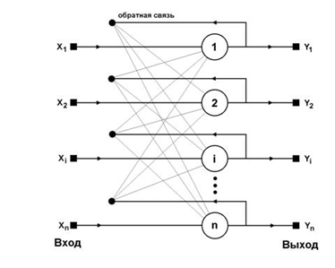
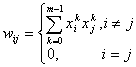
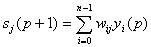
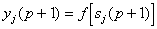
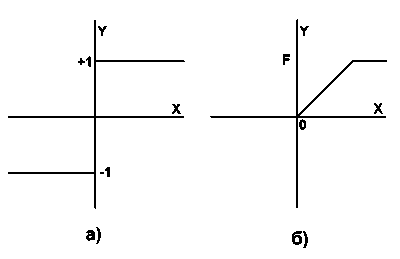

# Hopfield_network

The data is taken from a text file, where you can write an unlimited number of input vectors (x) and recognition vector (z). The last vector in the file should be written as vector z. The resulting vector (y) is represented as a graphic matrix.

The block diagram of the Hopfield network is shown in the figure. The network consists of a single layer of neurons, the number of which is simultaneously equal to the number of inputs and the number of outputs. Each neuron is connected by synapses to other neurons and has one input. Output signals are formed as usual on axons.

The input can be described by a vector. Each element of the vector is either +1 or -1.
When initializing the network, the coefficients are set as follows:

Here i and j are the indices, respectively, of the presynaptic and postsynaptic neurons; xik, xjk - the i-th and j-th elements of the vector of the k-th sample.

The network algorithm:
1. An unknown signal is supplied to the network inputs. In practice, its input occurs due to the establishment of axons yi (0) = xi, i = 0 ... n-1. Therefore, the designation on the network diagram of the input synapses in explicit form is purely conditional. A zero in the bracket to the right of yi means zero iteration in the network cycle.
2. The new state of neurons is calculated:

and new axon values

where p is the iteration number, f is the activation function in the form of a jump, shown in the figure.

3. Check if the output axon values have changed during the last iteration. If yes, go to step 2, otherwise (if the outputs have stabilized) - end. In this case, the output vector is a sample that is best combined with the input data.

For a Hopfield network, the number of memorized samples (m) should not exceed a value approximately equal to 0.15*n, samples should be weakly correlated.
